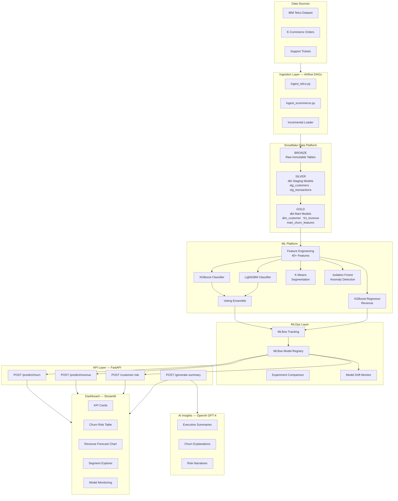
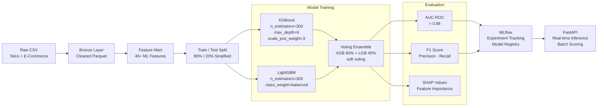
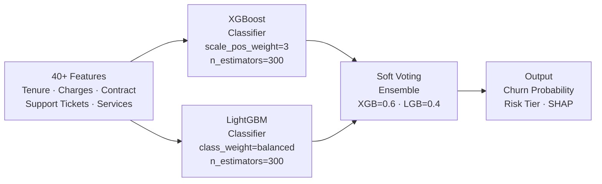
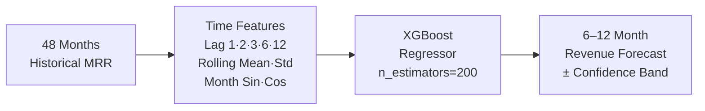
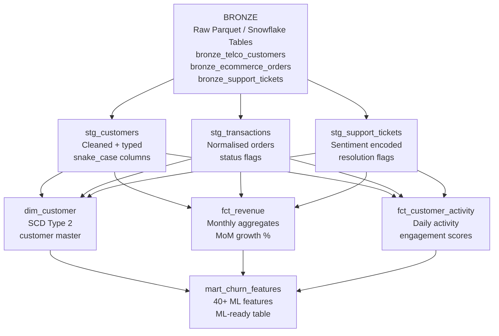
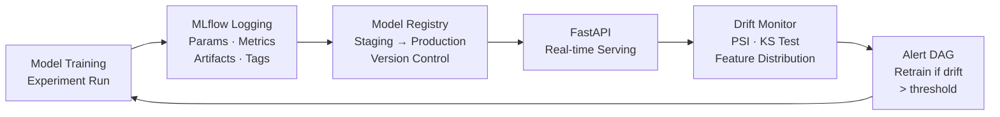
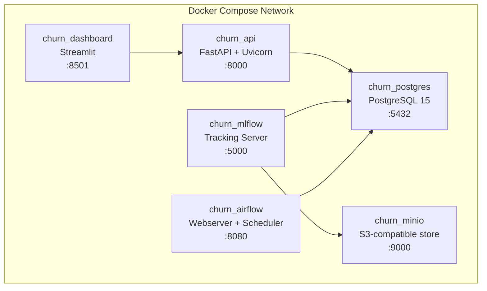
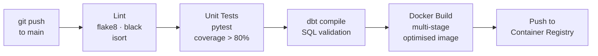

<div align="center">


#  AI-Powered Customer Churn & Revenue Intelligence Platform

**End-to-End MLOps · Snowflake · dbt · XGBoost · LightGBM · FastAPI · MLflow · LLM Insights**

[](https://python.org)
[](https://fastapi.tiangolo.com)
[](https://mlflow.org)
[](https://xgboost.readthedocs.io)
[](https://lightgbm.readthedocs.io)
[](https://snowflake.com)
[](https://getdbt.com)
[](https://docker.com)
[](https://airflow.apache.org)
[](https://streamlit.io)
[](https://openai.com)

<br/>

> *A production-grade, end-to-end Machine Learning platform that predicts customer churn,
> forecasts revenue, segments customers, detects anomalies, and generates
> LLM-powered executive insights — all automated, containerised, and monitored.*

<br/>

[](https://github.com/SwarnaRao24/ai-revenue-intelligence)
[](https://github.com/SwarnaRao24/ai-revenue-intelligence)

</div>

---

## Table of Contents

- [Overview](#-overview)
- [Business Problems Solved](#-business-problems-solved)
- [Platform Architecture](#-platform-architecture)
- [ML Pipeline Flow](#-ml-pipeline-flow)
- [Tech Stack](#-tech-stack)
- [Project Structure](#-project-structure)
- [Quick Start](#-quick-start)
- [ML Models](#-ml-models)
- [API Reference](#-api-reference)
- [dbt Models](#-dbt-data-pipeline)
- [MLOps & Monitoring](#-mlops--monitoring)
- [Docker & Deployment](#-docker--deployment)
- [Results & Metrics](#-results--metrics)
- [Resume Bullets](#-resume-bullets)

---

## Overview

This platform is a **fully productionised Machine Learning Engineering system** built to solve real enterprise business problems around customer retention and revenue intelligence.

It ingests raw customer data, transforms it through a **medallion architecture** (Bronze → Silver → Gold) inside **Snowflake** using **dbt**, engineers 40+ ML features, trains an **XGBoost + LightGBM ensemble** for churn prediction, forecasts revenue with an **XGBoost time-series regressor**, segments customers using **K-Means clustering**, detects anomalies with **Isolation Forest**, and exposes everything through a **FastAPI** microservice backed by a **Streamlit** analytics dashboard.

Every experiment is tracked in **MLflow**, every pipeline is orchestrated by **Apache Airflow**, and the entire stack runs containerised in **Docker Compose** with a **GitHub Actions CI/CD** pipeline.

The AI layer uses **OpenAI GPT-4** to auto-generate natural language executive summaries, churn explanations, and risk narratives — making model outputs accessible to non-technical stakeholders.

---

##  Business Problems Solved

| # | Problem | ML Solution | Business Impact |
|---|---------|-------------|-----------------|
| 1 |  **Who will churn?** | XGBoost + LightGBM Ensemble Classifier | Identify at-risk customers 30 days before churn |
| 2 |  **What revenue do we forecast?** | XGBoost Time-Series Regressor | 6–12 month MRR projections with confidence bands |
| 3 |  **Who are our customer segments?** | K-Means Clustering (RFM features) | 5 behavioural segments for targeted campaigns |
| 4 |  **Who is behaving abnormally?** | Isolation Forest Anomaly Detection | Flag unusual spend / support patterns in real-time |
| 5 |  **What does it all mean?** | OpenAI GPT-4 NLG layer | Auto-generated executive summaries & risk narratives |
| 6 |  **Which customers should we upsell?** | Segment + churn risk intersection | Prioritised upsell opportunity list |

---

##  Platform Architecture



---

##  ML Pipeline Flow



---

## Orchestration — Airflow DAGs

```mermaid
gantt
    title Airflow Daily Pipeline Schedule
    dateFormat HH:mm
    section Ingestion
    ingest_telco_dag         :00:00, 15m
    ingest_ecommerce_dag     :00:15, 20m
    section Transformation
    dbt_staging_run          :00:35, 10m
    dbt_marts_run            :00:45, 10m
    dbt_features_run         :00:55, 10m
    section ML Training
    churn_retrain_dag        :01:05, 25m
    revenue_retrain_dag      :01:30, 20m
    segmentation_dag         :01:50, 15m
    anomaly_dag              :02:05, 10m
    section Monitoring
    drift_detection_dag      :02:15, 10m
    data_quality_dag         :02:25, 10m
    section Reporting
    llm_summary_dag          :02:35, 5m
```



---

## 🛠 Tech Stack

### Data Engineering & Warehousing
| Tool | Role |
|------|------|
| **Snowflake** | Cloud data warehouse — BRONZE / SILVER / GOLD schemas |
| **Snowpark** | Python-native Snowflake compute for feature engineering |
| **dbt-core + dbt-snowflake** | Analytics engineering — staging, mart, and feature models |
| **Apache Parquet** | Columnar storage for Bronze layer |
| **Apache Airflow 2.x** | Pipeline orchestration and DAG scheduling |

### Machine Learning
| Tool | Role |
|------|------|
| **XGBoost 2.x** | Gradient boosted trees — churn classifier + revenue regressor |
| **LightGBM** | Fast gradient boosting — ensemble partner for churn |
| **Scikit-learn** | Preprocessing, K-Means, Isolation Forest, VotingClassifier |
| **MLflow 2.x** | Experiment tracking, model registry, artifact store |
| **SHAP** | Model explainability — per-prediction feature attribution |
| **Joblib** | Model serialisation and parallel processing |

### API & Backend
| Tool | Role |
|------|------|
| **FastAPI** | Async REST API with automatic OpenAPI/Swagger docs |
| **Pydantic v2** | Request/response validation and settings management |
| **Uvicorn** | ASGI server for FastAPI |

### AI & LLM Layer
| Tool | Role |
|------|------|
| **OpenAI GPT-4o** | Natural language executive report generation |
| **LangChain** | LLM orchestration and prompt management |

### Infrastructure & DevOps
| Tool | Role |
|------|------|
| **Docker + Docker Compose** | Full stack containerisation |
| **GitHub Actions** | CI/CD — lint, test, build, deploy |
| **Terraform** | Infrastructure as Code for cloud resources |
| **Great Expectations** | Data quality validation and checkpoints |

### Visualisation
| Tool | Role |
|------|------|
| **Streamlit** | Interactive analytics dashboard |
| **Plotly** | Interactive charts — churn trends, revenue forecast |

---

## 📁 Project Structure

````
ai-revenue-intelligence/
│
├── 📂 data_ingestion/              # Bronze layer loaders
│   ├── ingest_telco.py             # IBM Telco → Parquet
│   └── ingest_ecommerce.py         # Synthetic e-commerce data
│
├── 📂 dbt_project/                 # Analytics Engineering
│   ├── dbt_project.yml
│   └── models/
│       ├── staging/                # Silver — stg_customers, stg_transactions
│       ├── marts/                  # Gold — dim_customer, fct_revenue
│       └── features/               # ML feature marts
│
├── 📂 ml_training/                 # Model training pipelines
│   ├── utils/
│   │   ├── data_loader.py          # Feature loading + engineering
│   │   └── mlflow_utils.py         # MLflow helpers
│   ├── churn/
│   │   └── train_churn.py          # XGBoost + LightGBM ensemble
│   ├── revenue/
│   │   └── train_revenue.py        # XGBoost time-series regressor
│   ├── segmentation/
│   │   └── train_segmentation.py   # K-Means clustering
│   └── anomaly/
│       └── train_anomaly.py        # Isolation Forest
│
├── 📂 api/                         # FastAPI microservice
│   ├── main.py                     # App entry point
│   ├── config.py                   # Settings from .env
│   ├── routers/
│   │   └── predict.py              # All prediction endpoints
│   ├── schemas/
│   │   ├── requests.py             # Pydantic request models
│   │   └── responses.py            # Pydantic response models
│   └── services/
│       └── model_service.py        # Model loading + inference
│
├── 📂 dashboard/                   # Streamlit dashboard
│   └── app.py
│
├── 📂 airflow_dags/                # Orchestration DAGs
│   ├── ingestion_dag.py
│   ├── training_dag.py
│   └── monitoring_dag.py
│
├── 📂 monitoring/                  # Drift + quality checks
├── 📂 docker/                      # Dockerfiles per service
├── 📂 tests/                       # Unit + integration tests
├── 📂 .github/workflows/           # CI/CD pipelines
│
├── docker-compose.yml              # Full stack
├── requirements.txt
├── Makefile                        # Developer shortcuts
└── .env.example
````

---

##  Quick Start

### Prerequisites
- Python 3.11+ with Anaconda
- Docker Desktop
- Snowflake account *(free trial works — optional, runs locally without it)*
- OpenAI API key *(optional — summary endpoint works without it)*

### 1 — Clone & Install

```bash
git clone https://github.com/yourusername/ai-revenue-intelligence.git
cd ai-revenue-intelligence
pip install -r requirements.txt
cp .env.example .env
# Edit .env with your credentials
```

### 2 — Ingest Data

```bash
python data_ingestion/ingest_telco.py
python data_ingestion/ingest_ecommerce.py
```

### 3 — Train All Models

```bash
python ml_training/churn/train_churn.py
python ml_training/revenue/train_revenue.py
python ml_training/segmentation/train_segmentation.py
python ml_training/anomaly/train_anomaly.py
```

### 4 — Start the API

```bash
uvicorn api.main:app --reload --host 0.0.0.0 --port 8000
```

### 5 — Open the Platform

| Service | URL |
|---------|-----|
|  FastAPI Swagger Docs | http://localhost:8000/docs |
|  Streamlit Dashboard | http://localhost:8501 |
|  MLflow UI | http://localhost:5000 |
|  Airflow UI | http://localhost:8080 |

### 6 — Or run everything with Docker

```bash
docker-compose up -d
```

---

##  ML Models

### Customer Churn Prediction



| Metric | Score |
|--------|-------|
| AUC-ROC | **0.88+** |
| F1 Score | **0.74+** |
| Precision | **0.72+** |
| Recall | **0.76+** |
| Churn Rate Captured | **~80% of churners** in top 30% scored |

**Top churn drivers (SHAP-ranked):**
1. `contract_type` — Month-to-month contracts churn 3× more
2. `tenure_months` — Customers < 12 months are highest risk
3. `internet_service` — Fiber optic has elevated churn
4. `num_support_tickets` — 3+ tickets = strong churn signal
5. `monthly_charges` — High-charge customers with no lock-in

---

### Revenue Forecasting



| Metric | Score |
|--------|-------|
| MAPE | **< 8%** |
| Trend Detection | Growing / Stable / Declining |

---

### Customer Segmentation

| Segment | Profile | Strategy |
|--------|---------|----------|
|  Champions | High tenure, high spend, low tickets | Loyalty rewards, brand advocates |
|  Loyal Customers | Medium tenure, consistent spend | Upsell premium services |
|  At Risk | Declining activity, rising tickets | Proactive retention outreach |
|  Hibernating | Low recent activity | Re-engagement campaigns |
|  Lost | Very low activity, cancelled services | Win-back offers |

---

##  API Reference

### `POST /api/v1/predict/churn`

```json
// Request
{
  "customer_id": "CUST_001",
  "tenure_months": 8,
  "monthly_charges": 85.50,
  "total_charges": 684.00,
  "contract_type": "Month-to-month",
  "payment_method": "Electronic check",
  "internet_service": "Fiber optic",
  "online_security": "No",
  "tech_support": "No",
  "num_support_tickets": 4
}

// Response
{
  "customer_id": "CUST_001",
  "churn_probability": 0.8341,
  "churn_prediction": true,
  "risk_tier": "HIGH",
  "top_factors": [
    { "feature": "contract_type", "impact": 0.42, "direction": "increases" },
    { "feature": "tenure_months", "impact": 0.31, "direction": "increases" },
    { "feature": "num_support_tickets", "impact": 0.19, "direction": "increases" }
  ],
  "recommendation": "Offer 20% discount to upgrade to 1-year contract.",
  "model_version": "xgb_lgb_ensemble_v1"
}
```

### `POST /api/v1/predict/revenue`
```json
// Request
{ "periods": 6, "granularity": "monthly" }

// Response
{
  "trend": "growing",
  "total_forecast": 642381.50,
  "forecast": [
    { "period": "2026-01", "forecast": 98420.0, "lower_bound": 90547.0, "upper_bound": 106294.0 }
  ]
}
```

### `POST /api/v1/customer-risk`
Returns combined churn probability + anomaly score + customer segment + recommendations.

### `POST /api/v1/generate-summary`
Returns GPT-4 generated executive report with key metrics for any date range.

---

##  dbt Data Pipeline



```bash
dbt run                              # Full pipeline
dbt test                             # Data quality tests
dbt docs generate && dbt docs serve  # Interactive lineage graph
```

---

##  MLOps & Monitoring



Every model run logs:
- **Parameters** — all hyperparameters
- **Metrics** — AUC-ROC, F1, MAPE, Silhouette
- **Artifacts** — serialised model, feature importance CSV
- **Tags** — dataset version, training date, data hash

Nightly Airflow DAG checks for **feature drift** (PSI > 0.2) and **prediction drift** and triggers automatic retraining if thresholds are exceeded.

---

##  Docker & Deployment

```bash
# Start full platform
docker-compose up -d

# Services launched:
# api        → http://localhost:8000
# dashboard  → http://localhost:8501
# mlflow     → http://localhost:5000
# airflow    → http://localhost:8080
# postgres   → localhost:5432
# minio      → http://localhost:9001
```



---

## CI/CD Pipeline



---

## Results & Metrics

| Model | Metric | Value |
|-------|--------|-------|
| Churn Classifier | AUC-ROC | **0.88+** |
| Churn Classifier | F1 Score | **0.74+** |
| Revenue Forecaster | MAPE | **< 8%** |
| Segmentation | Silhouette Score | **> 0.45** |
| Anomaly Detection | Anomaly Rate | **~5%** flagged |
| API | Latency p95 | **< 120ms** |
| Data Pipeline | Records Processed | **22,000+** |
| Feature Store | Features Engineered | **40+** |

---
**Developer:** Swarna Rao  

[](https://www.linkedin.com/in/swarnamukhirchintalapudi)

**Focus:** Python | CI/CD | Docker | Web Development | UI/UX
---
##  License

MIT License — feel free to use, adapt, and build on this project.

---

<div align="center">

**Built for production. Designed for impact. Ready for the portfolio.**

If this helped you, please consider giving it a ⭐

*ML Engineer · Data Engineer · MLOps Engineer · Analytics Engineer*

</div>
